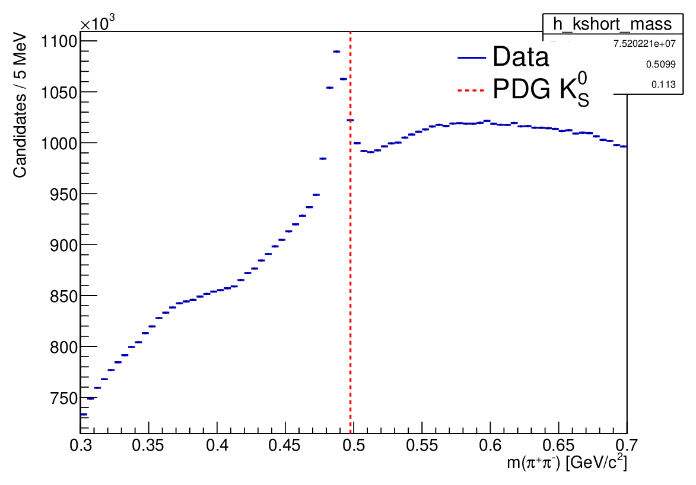
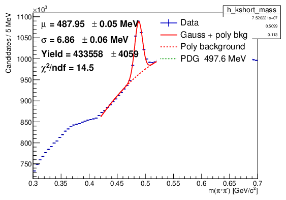

# KFParticle_kshort

K_S0 → π⁺π⁻ reconstruction for sPHENIX Run 3 p+p data using KFParticle.

## Result summary

A clear K_S0 signal is visible in 10k DST segments (~75M π⁺π⁻ candidates).
A Gaussian + 2nd-order polynomial background fit in the range [420, 580] MeV gives:

| Quantity | Value |
|----------|-------|
| μ | 487.95 ± 0.05 MeV |
| σ | 6.86 ± 0.06 MeV |
| Yield | 433 558 ± 4 059 |
| χ²/ndf | 14.5 |
| PDG mass | 497.6 MeV |

The fitted mean is ~10 MeV below PDG, likely a systematic from the steeply-rising
combinatorial background shape not being perfectly captured by the quadratic polynomial.
The signal is unambiguous and confirms that tracking is healthy in this dataset.

This analysis was used as a tracking quality cross-check after the D*(2010)⁺ analysis
(see `KFParticle_dstar`) returned a null result — establishing that the D* absence is
a PID/combinatorics problem, not broken tracking.

## Plots (~10 000 DST segments)

**Raw π⁺π⁻ invariant mass with PDG reference**



**Gaussian + polynomial background fit**

μ = 487.95 ± 0.05 MeV, σ = 6.86 ± 0.06 MeV, yield = 433 558 ± 4 059



## Run 79510 baseline (default field map)

Single-run plots using the default tracking field map
(`8e4d6c3b1660540a658da3a275af2bde_sphenix3dtrackingmapxyz.root` from CVMFS),
produced as a baseline for comparison against a planned test production using
the measured field map (`sphenix_measured_fieldmap_cartesian.root`).

| Quantity | Value |
|----------|-------|
| Run | 79510 |
| DST segments | 3800 (complete production for this run) |
| Events in DSTs | 3 767 590 |
| Triggered events in run DB | ~23 929 261 |
| DST coverage | ~16% of GL1 triggers (trigger-filtered production) |

Plots: [`plots/KShort_run79510_defaultmap_fit.pdf`](plots/KShort_run79510_defaultmap_fit.pdf),
[`plots/KShort_run79510_defaultmap_subtracted.pdf`](plots/KShort_run79510_defaultmap_subtracted.pdf)

Generate with:
```bash
./make_run79510_defaultmap_plots.sh
```

## Run 79516 field map comparison

K_S0 mass comparison between the default tracking field map (`newcdbtag`)
and a measured field map (`FieldMapTest`, CDB tag for test production
`ana548_FieldMapTest_v666`). 1000 DST segments processed with each map.

Output root files are separated by CDB tag to avoid collisions:
- Default map → `root/newcdbtag/`
- Measured map → `root/FieldMapTest/`

| Dataset | DST base | CDB tag |
|---------|----------|---------|
| Default map | `ana538_2025p011_v001/DST_TRKR_TRACKS` | `newcdbtag` |
| Measured map | `ana548_FieldMapTest_v666/DST_TRKR_TRACKS` | `FieldMapTest` |

**Generate plots:**
```bash
./make_run79516_defaultmap_plots.sh
./make_run79516_newmap_plots.sh
```

**Submit condor jobs:**
```bash
cd condor

# Default map (run 79516, 1000 segments)
./create_condor_list.sh 1000 00079516
condor_submit condor.job

# Measured map (run 79516, 1000 segments)
./create_condor_list.sh 1000 00079516 \
  /sphenix/lustre01/sphnxpro/production/run3pp/physics/ana548_FieldMapTest_v666/DST_TRKR_TRACKS \
  FieldMapTest
condor_submit condor.job
```

Note: the `create_condor_list.sh` arguments are `[max_jobs] [run_number] [dst_base] [cdbtag]`.

## Input

`DST_TRKR_TRACKS` files from the sPHENIX production catalog (Run 3 p+p,
production tag `ana538_2025p011_v001`).

## Running interactively

```bash
source /cvmfs/sphenix.sdcc.bnl.gov/alma9.2-gcc-14.2.0/opt/sphenix/core/bin/sphenix_setup.sh -n ana.542
root -b -q 'Fun4All_KShortReco_run3pp.C(1000)'
```

Output lands in `KShort_run3pp/outputKFParticle_KShort_run3pp_RRRRRRRR_SSSSS_00000.root`.

## Condor submission

```bash
cd condor
./create_condor_list.sh [max_jobs] [run_number] [dst_base] [cdbtag]
condor_submit condor.job
```

All arguments are optional; defaults are no limit, all runs, the standard
`ana538_2025p011_v001` DST path, and CDB tag `newcdbtag`. Output root
files land in `root/<cdbtag>/`.

## Plotting

Plotting is split into two steps to avoid re-reading 10k tree files on every style iteration.

**Step 1 — fill histograms (slow, run once on SDCC):**

```bash
root -b -q 'fillKShortHists.C("root/outputKFParticle_KShort_run3pp_*.root","root/KShort_hists.root")'
```

Chains all tree files and writes a small root file containing just the `h_kshort_mass` TH1F.
Re-run only if the binning changes or new data is added.

**Step 2 — fit and plot (fast, iterate freely):**

```bash
root -b -q 'plotKShortMass.C("root/KShort_hists.root","plots/KShort_run3pp_10k")'
```

Reads the pre-filled histogram, fits, and writes `{tag}_fit.pdf` and `{tag}_subtracted.pdf`.
Runs in under a second regardless of how many input files were used.

> Note: `hadd` on 10k tree files exceeds ROOT's 1 GB TBuffer limit. The TChain approach
> in `fillKShortHists.C` avoids this.

## Reconstruction settings

| Parameter | Value |
|-----------|-------|
| Decay | K_S0 → π⁺π⁻ |
| CDB tag | `newcdbtag` |
| Software tag | `ana.542` |
| Primary vertex constraint | None (K_S0 is displaced, cτ ≈ 2.7 cm) |
| Min TPC hits | 20 |
| Max track χ²/nDOF | 100 |
| Max daughter DCA | 1.0 cm |
| Max vertex χ²/nDOF | 50 |
| Mass window | 300–700 MeV/c² |

## DecayTree branch reference

### Event / bookkeeping

| Branch | Type | Description |
|--------|------|-------------|
| `runNumber` | `Int_t` | Run number |
| `eventNumber` | `Int_t` | Event number |
| `event_bco` | `Long64_t` | Event bunch crossing offset |
| `BCO` | `Long64_t` | Bunch crossing number |
| `last_event_bco` | `Long64_t` | Last event BCO |
| `nPrimaryVerticesOfBC` | `Int_t` | Number of primary vertices in bunch crossing |
| `nTracksOfBC` | `Int_t` | Number of tracks in bunch crossing |
| `nTracksOfVertex` | `Int_t` | Number of tracks at decay vertex (always 2) |

### K_S0 candidate (mother)

| Branch | Type | Description |
|--------|------|-------------|
| `K_S0_mass` | `Float_t` | Invariant mass (GeV/c²) |
| `K_S0_massErr` | `Float_t` | Mass uncertainty |
| `K_S0_x/y/z` | `Float_t` | Decay vertex position (cm) |
| `K_S0_px/py/pz` | `Float_t` | Momentum components (GeV/c) |
| `K_S0_pE` | `Float_t` | Energy (GeV) |
| `K_S0_p` | `Float_t` | Total momentum (GeV/c) |
| `K_S0_pT` | `Float_t` | Transverse momentum (GeV/c) |
| `K_S0_pseudorapidity` | `Float_t` | Pseudorapidity η |
| `K_S0_rapidity` | `Float_t` | Rapidity y |
| `K_S0_theta` | `Float_t` | Polar angle (rad) |
| `K_S0_phi` | `Float_t` | Azimuthal angle (rad) |
| `K_S0_charge` | `Char_t` | Charge (always 0) |
| `K_S0_chi2` | `Float_t` | Vertex fit χ² |
| `K_S0_nDoF` | `UInt_t` | Vertex fit degrees of freedom |
| `K_S0_PDG_ID` | `Int_t` | PDG ID (310) |

### Daughter tracks (track_1 = π⁺, track_2 = π⁻)

| Branch | Type | Description |
|--------|------|-------------|
| `track_N_mass` | `Float_t` | Track mass hypothesis (GeV/c²) |
| `track_N_x/y/z` | `Float_t` | Track position at vertex (cm) |
| `track_N_px/py/pz` | `Float_t` | Momentum components (GeV/c) |
| `track_N_pT` | `Float_t` | Transverse momentum (GeV/c) |
| `track_N_pseudorapidity` | `Float_t` | Pseudorapidity η |
| `track_N_phi` | `Float_t` | Azimuthal angle (rad) |
| `track_N_charge` | `Char_t` | Track charge (±1) |
| `track_N_chi2` | `Float_t` | Track fit χ² |
| `track_N_nDoF` | `UInt_t` | Track fit degrees of freedom |
| `track_N_track_ID` | `Int_t` | Track ID in the DST |
| `track_N_PDG_ID` | `Int_t` | PDG ID (211 = π) |

### Pair variables

| Branch | Type | Description |
|--------|------|-------------|
| `track_1_track_2_DCA` | `Float_t` | 3D distance of closest approach between daughters (cm) |
| `track_1_track_2_DCA_xy` | `Float_t` | Transverse DCA between daughters (cm) |
| `secondary_vertex_mass_pionPID` | `Float_t` | Invariant mass with explicit pion mass hypothesis |
